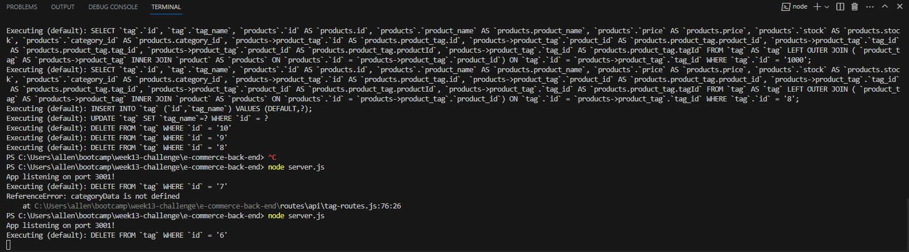
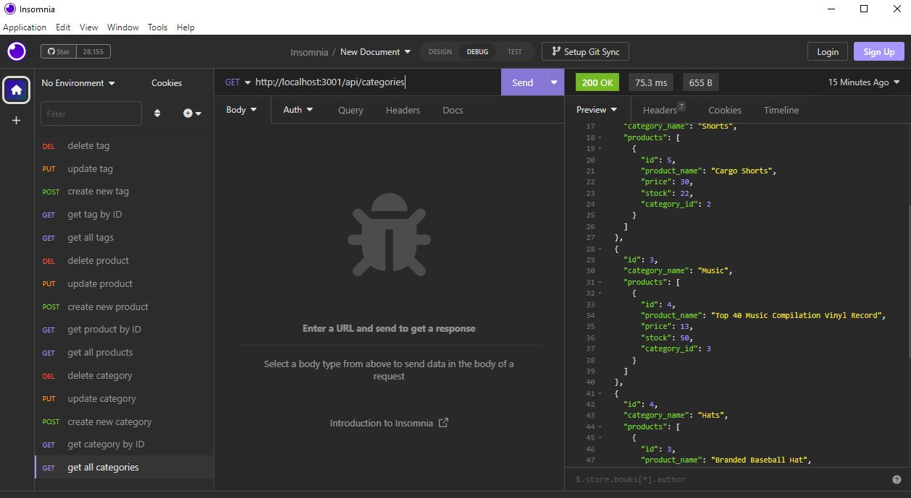

# e-commerce-back-end

## Description

This program is a backend for an e-commerce application.

## Table of Contents
- [Installation](#installation)
- [Usage](#usage)
- [Screenshot](#screenshot)
- [Video recording](#video-recording)
- [Credits](#credits)
- [License](#license)
- [Badges](#badges)
- [Features](#features)
- [Contributing](#contributing)
- [Tests](#tests)
- [Email address](#email-address)
- [Github username](#github-username)

## Installation
Run npm install to install the dependencies.
Run the schema.sql file in db folder to initialise the ecommerce_db.
Run the index.js under the seeds folder to create the tables and seed the tables with data.
Then run "node server.js" to run the application.

## Usage
The program is not deployed and can only be run on the terminal. To demo the program, i used insomnia to run through all the routes for all the models.

## Screenshot

Below is a screenshot of the application when ran using command line.

Below is a screenshot of the demo using insomnia.

## Video recording

Video recording explaining the application can be viewed here: https://drive.google.com/file/d/1Culkjw94HtiKt3fSRoZyAF3RrJOe7bjs/view

## Credits
none

## License
n/a

## Badges

## Features
The following are the functions of the program:
- get all categories
- get category by id
- create a category
- update a category
- delete a category
- get all products
- get product by id
- create a product
- update a product
- delete a product
- get all tags
- get tag by id
- create a tag
- update a tag
- delete a tag

## Contributing
n/a

## Tests
N/A

## Email address
allen.tuazon@gmail.com

## Github username
allentpogi